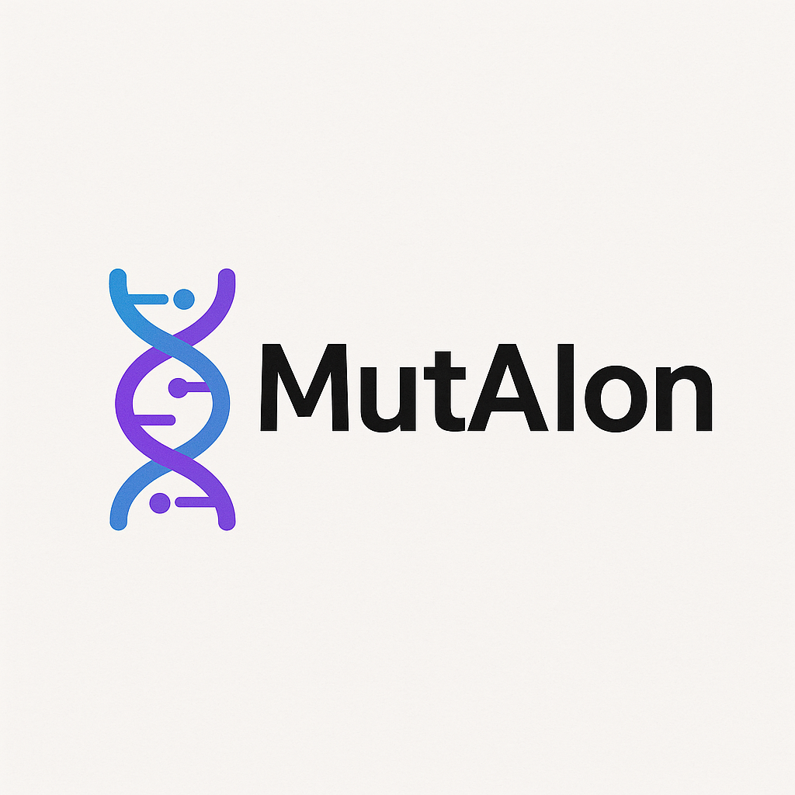

 

## MutAIon - LLM based Variant Analysis WebApp

This project implements a web application for variant effect prediction, leveraging the Evo2 large language model to determine the pathogenicity of single nucleotide variants (SNVs). It includes:

* **Python Backend**: A FastAPI service running on an H100 GPU via Modal serverless infrastructure.
* **AI Model**: Evo2 for classifying SNVs as pathogenic or benign.
* **Database Integration**: Fetches ClinVar classifications for comparison.
* **Frontend**: Built with Next.js, React, TypeScript, Tailwind CSS, and Shadcn UI (T3 Stack).
* **Features**:

  * Genome assembly selection
  * Chromosome browsing and gene search (e.g., BRCA1)
  * Reference genome display
  * Mutation input and prediction
  * Comparison with ClinVar data

## Architecture

### Backend

* **Framework**: FastAPI
* **Deployment**: Modal serverless GPU (H100)
* **Endpoint**: `/predict` accepts gene, position, reference and alternative alleles, returns pathogenicity score and label.
* **Dependencies**: `evo2`, `modal`, `fastapi`, `uvicorn`, `sqlalchemy`, `requests`

### Frontend

* **Framework**: Next.js with TypeScript
* **Styling**: Tailwind CSS
* **Components**: Shadcn UI (Buttons, Inputs, Cards)
* **Pages**:

  * `/` Assembly selection
  * `/browse/[assembly]` Chromosome listing
  * `/gene/[geneId]` Gene details and sequence
* **API Integration**: Uses React Query to call FastAPI endpoints.

## Setup

### Prerequisites

* Node.js >= 18
* Python 3.10+
* Modal CLI and account

### Backend Installation

```bash
cd backend
pip install -r requirements.txt
modal deploy
```

### Frontend Installation

```bash
cd frontend
npm install
npm run dev
```

## Usage

1. Launch backend via Modal.
2. Start frontend in development mode.
3. Navigate to `http://localhost:3000`, select your genome assembly.
4. Browse or search for genes, input mutations or select existing variations.
5. View Evo2 predictions alongside ClinVar classifications.

## Contributing

Contributions are welcome! Please open issues or submit pull requests.

## License

MIT License
